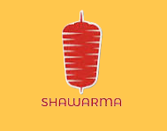

<a name="readme-top"></a>

<div align="center">

[![Contributors][contributors-shield]][contributors-url]
[![Forks][forks-shield]][forks-url]
[![Stargazers][stars-shield]][stars-url]
[![Issues][issues-shield]][issues-url]
[![Apache License 2.0][license-shield]][license-url]

</div>
<br />
<div align="center">
  <a href="https://github.com/anuraghazra/github-readme-stats">
    <picture>
      <source media="(prefers-color-scheme: dark)" srcset="assets/logo-white.png">
      
    </picture>
  </a>

  <h3 align="center">Where every bite feels like home!</h3>

  <p align="center">
    <a href="https://codehasan.github.io/BurgerHouse">View Demo</a>
    &nbsp;
    |
    &nbsp;
    <a href="https://github.com/codehasan/BurgerHouse/issues/new?labels=bug&template=bug-report---.md">Report Bug</a>
    &nbsp;
    |
    &nbsp;
    <a href="https://github.com/codehasan/BurgerHouse/issues/new?labels=enhancement&template=feature-request---.md">Request Feature</a>
  </p>
</div>

## About The Project

<div align="center">
  <a href="https://codehasan.github.io/BurgerHouse">
    
  </a>
</div>
<br/>
   
This project is built to learn the fundamentals of full-stack web development. It leverages popular CSS features like transitions, responsive media queries, and flexbox. Through this, I'm exploring how to create a dynamic and user-friendly interface. The project also gives me hands-on experience with the basics of both front-end and back-end development, helping me to better understand how everything works together in a full-stack environment.

### Built With


## Install & Run

- Clone the repo

  ```sh
  git clone https://github.com/codehasan/BurgerHouse.git
  ```

- Install http-server

  ```sh
  npm install http-server -g
  ```

- Start http-server on the cloned folder

  ```sh
  cd BurgerHouse
  npx http-server -p 8080
  ```

- Follow the link to preview the website in a browser

  ```sh
  http://localhost:8080/
  ```

## Roadmap

- [x] Make responsive NavBar.
- [x] Setup hero layout.
- [x] Build promotional cards.
- [x] Build trending burgers layout.
- [x] Create upcoming events layout.
- [x] Implement table booking system.
- [x] Create responsive footer.

See the [open issues](https://github.com/codehasan/BurgerHouse/issues) for a full list of proposed features (and known issues).

## Contributing

Contributions are what make the open source community such an amazing place to learn, inspire, and create. Any contributions you make are **greatly appreciated**.

If you have a suggestion that would make this better, please fork the repo and create a pull request. You can also simply open an issue with the tag "enhancement".
Don't forget to give the project a star! Thanks again!

1. Fork the Project
2. Create your Feature Branch (`git checkout -b feature/AmazingFeature`)
3. Commit your Changes (`git commit -m 'Add some AmazingFeature'`)
4. Push to the Branch (`git push origin feature/AmazingFeature`)
5. Open a Pull Request

## License

Distributed under the Apache License (2.0) . See `LICENSE` for terms and conditions.

```
Copyright (c) 2024 Ratul Hasan

Licensed under the Apache License, Version 2.0 (the "License");
you may not use this file except in compliance with the License.
You may obtain a copy of the License at

       http://www.apache.org/licenses/LICENSE-2.0

Unless required by applicable law or agreed to in writing, software
distributed under the License is distributed on an "AS IS" BASIS,
WITHOUT WARRANTIES OR CONDITIONS OF ANY KIND, either express or implied.
See the License for the specific language governing permissions and
limitations under the License.
```

## Contact

You can contact me using either of these social media platforms or send me an email.

- [](https://www.linkedin.com/in/codehasan)
- [](https://t.me/codehasan)
- [](https://twitter.com/code_hasan)
- [](mailto:ratul.hasan.rahat.bd@gmail.com)

---

<p align="right"><a href="#readme-top">Back to top</a></p>

[contributors-shield]: https://img.shields.io/github/contributors/codehasan/BurgerHouse.svg?style=for-the-badge
[contributors-url]: https://github.com/codehasan/BurgerHouse/graphs/contributors
[forks-shield]: https://img.shields.io/github/forks/codehasan/BurgerHouse.svg?style=for-the-badge
[forks-url]: https://github.com/codehasan/BurgerHouse/network/members
[stars-shield]: https://img.shields.io/github/stars/codehasan/BurgerHouse.svg?style=for-the-badge
[stars-url]: https://github.com/codehasan/BurgerHouse/stargazers
[issues-shield]: https://img.shields.io/github/issues/codehasan/BurgerHouse.svg?style=for-the-badge
[issues-url]: https://github.com/codehasan/BurgerHouse/issues
[license-shield]: https://img.shields.io/github/license/codehasan/BurgerHouse.svg?style=for-the-badge
[license-url]: https://github.com/codehasan/BurgerHouse/blob/master/LICENSE
